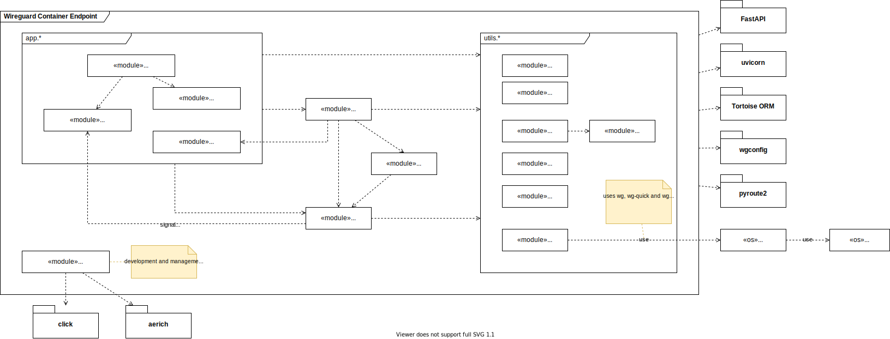

# Development Notes

## Codebase Overview

The following diagram shows an overview about the code base and describes the actions that are implemented in the modules of this application.

## Guidelines & Conventions

The following guidelines should apply to the development of this project:

* when calling OS-level subprocesses (Linux only), use the `utils.generics.AsyncSubProcessMixin` and at least disable them using the `disable_os_level_commands` fixture within the pytest unit-tests to avoid issues with the CI runner. These components should be tested as part of the E2E test-phase, which are not part or the pipeline due to the environment requirements
