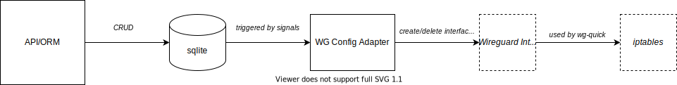

# Configuration Database

* Status: accepted
* Date: 2022-01-29

## Context and Problem Statement

The configuration database must store the data about the wireguard interfaces, peers and rules and should be configured on the system through an adapter (see following diagram). This data will be changed less fequent and write performance of the database should not be an issue. The update of the Wireguard configuration on the system should be triggered if certain entities are changed in the database.

The proposed data model is documented at [0001](0001-data-model.md).

## Considered Options

* [option 1] use sqlite to store data
* [option 2] use a dedicated database service bundled with the Container

## Decision Outcome

To avoid a dependency to an external system and due to the expected read/write performance, [option 1] will be implemented. Compared to [option 2], [option 1] has less footprint for the deployment and operation of the application. Together with the less changes that are expected on the configuration, [option 1] seems to be a reasonable choice.

## Links <!-- optional -->

* [0001 Data Model for the Application](0001-data-model.md)
