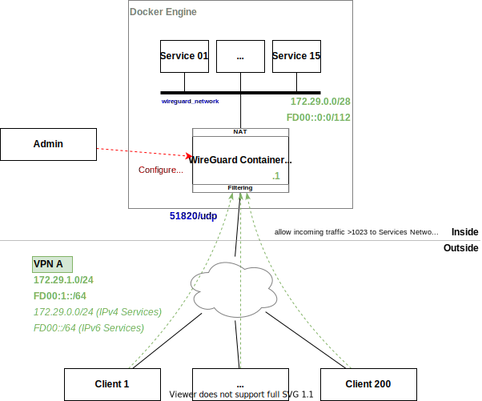

# Scenarios

The following scenarios describe the Use Cases for the Container.

## Hub-and-Spoke Remote Access (Scenario 1)

Single Server connectivity in a Hub-and-Spoke Topology with IP routing on the Wireguard Container. Furthermore, it must support access filtering for the VPN traffic.

The manual configuration is explained [here](scenario_1/manual_configuration.md).

## Partial Mesh with Multiple Temporary Hubs (Scenario 2)

Partial Mesh topology using a permanent Hub together with some additional temporary Hubs to provide access to other Services/Containers. The connectivity for the Clients is either through the Hub or directly using a second tunnel with more specific target IP addresses.

**With Wireguard**, full connectivity is only possible when all tunnels are active. To provide some basic redundancy for a Client, a "dynamic peer route" function needs to be implemented. This should inject the routes into the local routing table based on the tunnel state on the Tempoda Hub from the scenario.

The manual configuration is explained [here](scenario_2/manual_configuration.md).
